# Feature Specification: Trusted QA SMS Pattern Intake

**Feature Branch**: `codex/phase-2a-trusted-qa-sms-patterns-750` **Created**:
2026-07-13 **Status**: Implemented and ready for review; native QA remains
documented **Tracking Issue**: #750 **Umbrella Issue**: #744 **Input**: User
description: "Phase 2A should derive privacy-safe, reviewable QNB financial SMS
template candidates from explicitly authorized messages on a QA device,
beginning with EGP and USD transaction and non-transaction message families. Raw
SMS must remain local, and no resulting pattern may affect production parsing
during this phase."

## Clarifications

### Session 2026-07-13

- Q: Can three matching messages from the current QA device establish production
  trust? -> A: No. They establish a review-ready family; production trust
  additionally requires independent corroboration in Phase 2B or 2C.
- Q: May sanitized candidates preserve the provider sender identifier? -> A:
  Yes. Preserve a normalized, operator-verified QNB sender alias as provider
  metadata; remove personal phone numbers and unverified sender identifiers.
- Q: May the QA operator correct an automatically sanitized candidate? -> A:
  Yes. Placeholder boundaries and types may be corrected locally before export,
  and the complete candidate must pass sanitization validation again.
- Q: Should structurally identical EGP and USD messages share a template family?
  -> A: Yes. They may share one family when fixed wording, placeholder roles,
  direction, and meaning are identical, but each currency requires its own
  evidence and tests.
- Q: How should an approved sanitized candidate leave the QA device? -> A:
  Create a local sanitized artifact that the QA operator inspects and manually
  transfers; do not use clipboard export or automatic upload.

## UX Reference

The original primary flow, corrected v2 boards, and secondary interaction board
resolve the formal analysis findings and require final visual approval before
implementation:

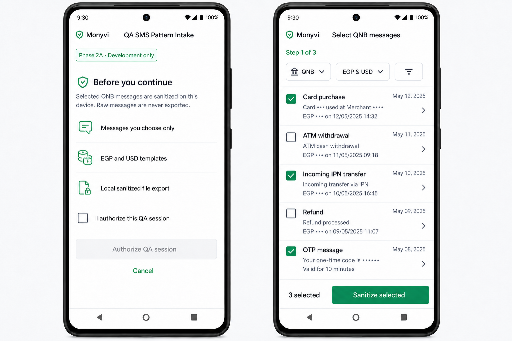

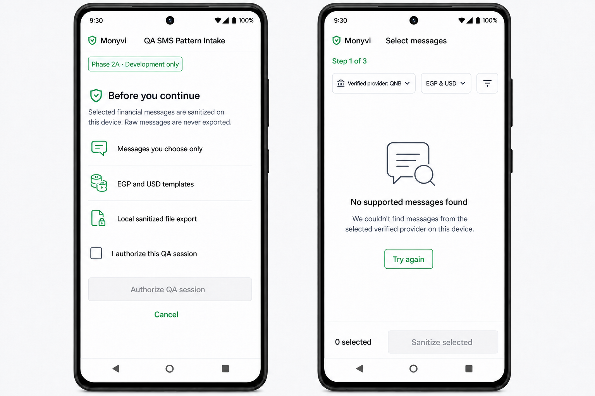

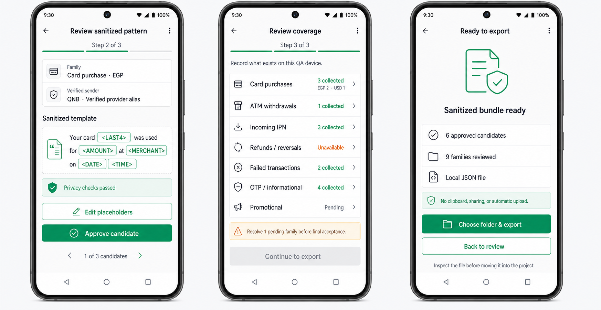

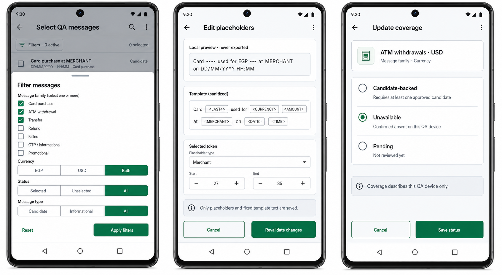

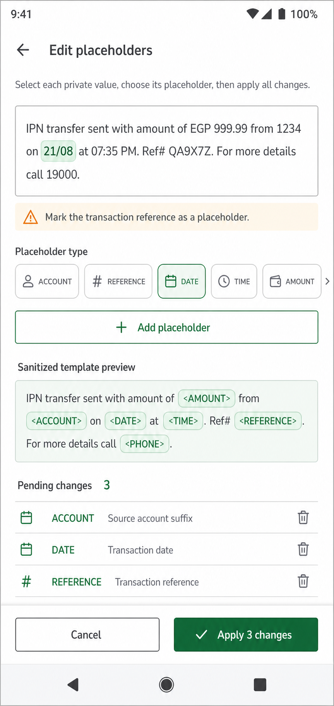

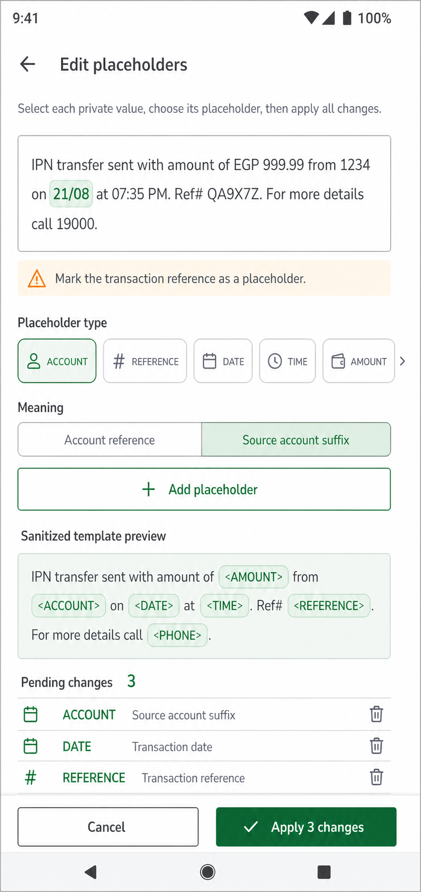

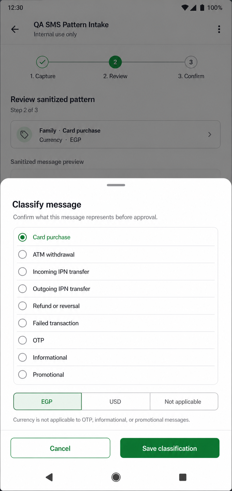

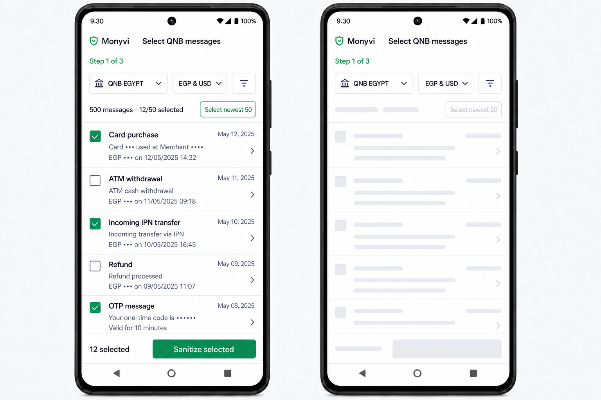

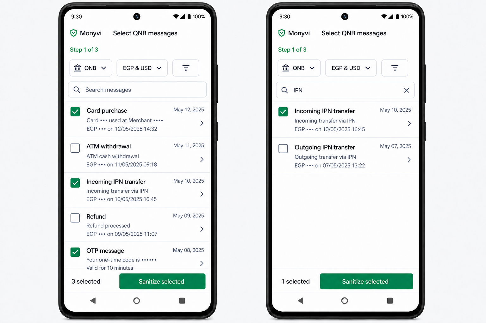

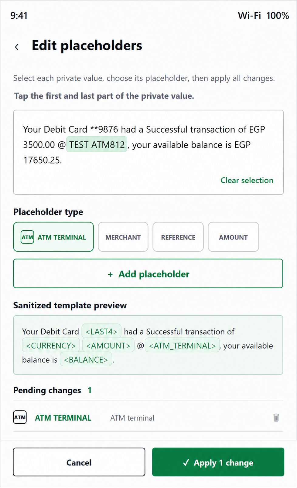

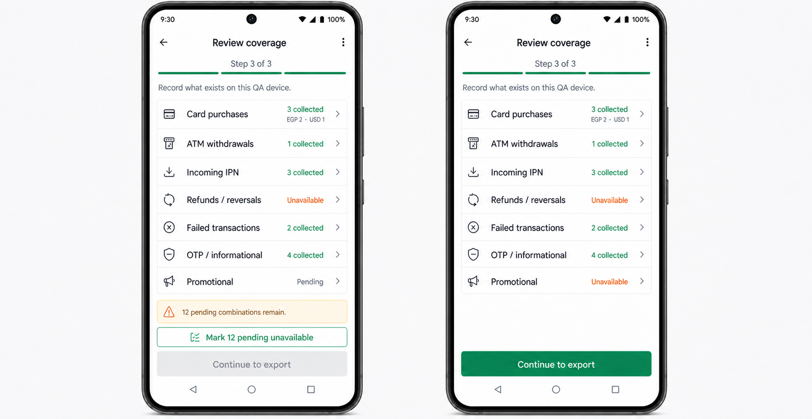

The mockups define the information architecture and interaction sequence. The
implementation must use Monyvi's existing `PageHeader`, components, typography,
theme tokens, safe-area behavior, and light/dark colors rather than treating the
generated colors or device chrome as new design-system values. Counts, dates,
and synthetic message previews in the images are illustrative, not fixed data.

Approved states:

1. **Authorization**: Development-only badge, provider-neutral privacy
   explanation, three scope rows, explicit authorization checkbox, primary
   authorization action, and cancel action. The initial checkbox is unchecked
   and the primary action is disabled until the operator checks it.
2. **Selection**: Fixed verified-QNB scope, literal EGP/USD content filters,
   selected/unselected filters, local sender/body search, selectable virtualized
   SMS rows, loaded and selected counts, `Select newest 50`, and compact sticky
   `Sanitize selected` action. Search composes with applied filters without
   clearing hidden selections. Loading skeletons mirror the visible row geometry
   while the footer remains fixed. If no verified QNB messages are found, the
   state explains that no supported messages were found and offers an explicit
   retry without broadening the inbox query.
3. **Sanitized review**: Operator-confirmed family/currency and verified alias
   summary, structured placeholder template, privacy result, placeholder
   correction action, candidate approval action, and candidate pagination.
4. **Coverage review**: Nine compact family groups with collected, unavailable,
   or pending summaries; expanding a group exposes every required
   family/currency scope for direct editing. OTP and informational scopes share
   one visual group but remain independent coverage declarations. Pending
   coverage keeps export visibly disabled. A bulk action may mark only pending
   scopes unavailable; it must preserve candidate-backed and previously resolved
   scopes.
5. **Local export**: Approved-candidate count, reviewed-family count, local JSON
   destination, explicit no-clipboard/no-upload reassurance, folder-selection
   action, success feedback after the folder write completes, and
   return-to-review action.

Approved secondary interactions:

- The filter sheet changes only literal currency and selection-status filters
  and applies them without processing messages. It does not infer message family
  or transaction type before the operator classifies a candidate.
- Message search runs only against the already-loaded local sender, verified
  provider label, and message body. It is case-insensitive, composes with the
  applied literal filters, never changes the selected set, and provides a clear
  action plus a dedicated no-match state.
- Placeholder correction shows the selected raw preview locally beside
  structured segments, permits only boundary/type corrections, and invalidates
  approval until revalidation passes. The operator can stage multiple
  non-overlapping corrections in one editor session, inspect the live sanitized
  preview and pending-change list, remove a pending correction, and apply the
  complete batch once. Raw-range selection uses the approved local tap-range
  interaction: the first tap anchors a character-accurate range, the second tap
  extends it, a later tap begins a new range, and Clear selection removes it.
  Native clipboard or text-selection actions are not exposed.
- Tapping the family/currency summary opens the approved classification sheet.
  The operator must explicitly choose one of the ten Phase 2A families and EGP,
  USD, or Not applicable. Not applicable is valid only for OTP, informational,
  and promotional messages; the tool must not infer classification from raw SMS
  wording or call an AI provider.
- The operator may discard a blocked candidate. Discard removes only that
  in-memory candidate and its selection from the QA session, never the device
  SMS. If no candidates remain, the flow returns to message selection.
- Header back moves from sanitized review to selection, coverage to sanitized
  review, and export to coverage. It exits the tool only from the authorization
  or selection boundary. Candidate arrows paginate candidates only.
- Coverage editing lets the operator mark one family/currency combination as
  candidate-backed, unavailable, or pending; candidate-backed status requires a
  referenced approved candidate.
- The bulk unavailable action changes only declarations whose current status is
  `pending`; it never overwrites candidate-backed or already-resolved coverage.
- SMS permission denial, blocking, or revocation reuses Monyvi's existing custom
  SMS permission explanation/recovery UI before any native permission request or
  device-settings navigation.

## User Scenarios & Testing _(mandatory)_

### User Story 1 - Sanitize Selected QA Messages Locally (Priority: P1)

As the authorized QA operator, I want to select known QNB messages and convert
them into sanitized template candidates on my own device, so the project can
learn real message structures without exposing my financial or personal data.

**Why this priority**: Trusted provenance is useful only if the intake boundary
protects the source message. Raw-message containment is the primary privacy
invariant for this phase.

**Independent Test**: Select authorized QA messages containing distinct personal
and financial values, create candidate reports, and verify that raw content
never appears outside the local processing boundary while every sensitive value
is replaced or rejected.

**Acceptance Scenarios**:

1. **Given** the QA operator explicitly selects a QNB message, **When** a
   candidate report is produced, **Then** the raw message remains local and the
   report contains only sanitized structure, approved metadata, and safe
   diagnostics.
2. **Given** a selected message contains an amount, balance, account or card
   identifier, reference, merchant, person, phone number, date, or time,
   **When** sanitization completes, **Then** each sensitive value is replaced by
   its canonical placeholder before the report can be reviewed or exported.
3. **Given** sanitization cannot confidently classify a sensitive value,
   **When** the report is validated, **Then** export is blocked until the
   operator either corrects the placeholder locally and the complete candidate
   passes revalidation or discards the candidate.
4. **Given** no message was explicitly selected, **When** intake is requested,
   **Then** no inbox message is read into a candidate report.
5. **Given** a candidate passes local review and validation, **When** the
   operator approves export, **Then** an inspectable sanitized local artifact is
   created for manual transfer without using the clipboard or a remote service.

---

### User Story 2 - Build Real QNB Template Families (Priority: P1)

As the product team, I want sanitized candidates grouped into QNB template
families, so fixed provider wording can be separated from changing transaction
values across EGP and USD messages.

**Why this priority**: The local parser currently cannot recognize the real
messages on the QA device. Stable families are the evidence needed to replace
invented test shapes with real provider structures safely.

**Independent Test**: Process sanitized samples from each available family and
verify that structurally equivalent messages group together, materially
different structures remain separate, and currency or transaction direction is
not inferred incorrectly.

**Acceptance Scenarios**:

1. **Given** three sanitized messages share the same fixed provider wording and
   placeholder positions, **When** they are compared, **Then** they form one
   review-ready template family with an evidence count of three.
2. **Given** two messages differ in fixed wording, token order, transaction
   direction, or semantic outcome, **When** they are compared, **Then** they are
   kept in separate families even if they came from the same sender.
3. **Given** one sanitized message has no structural peers, **When** cataloged,
   **Then** it remains a candidate sample and cannot be treated as an
   established family.
4. **Given** EGP and USD variants share wording but have distinct currency
   evidence, **When** cataloged, **Then** they may share one family only when
   their structure, direction, and meaning are identical, and each currency is
   represented explicitly and validated independently.

---

### User Story 3 - Review Positive and Negative Financial Behavior (Priority: P2)

As a reviewer, I want every candidate family to declare its expected parsing or
rejection behavior, so real financial messages can be supported without
misclassifying failed, security, informational, or promotional messages.

**Why this priority**: A financial parser must be at least as deliberate about
what it rejects as what it accepts. False positives can create incorrect
financial records or unsafe confidence.

**Independent Test**: Review representative positive and negative samples and
confirm each family either yields the expected review-only transaction shape or
is explicitly rejected before extraction.

**Acceptance Scenarios**:

1. **Given** a card purchase, ATM withdrawal, incoming IPN transfer, outgoing
   IPN transfer, refund, or reversal family, **When** it is reviewed, **Then**
   its expected direction, currency, required fields, and review reasons are
   explicit and testable.
2. **Given** a failed transaction, OTP, informational, or promotional family,
   **When** it is reviewed, **Then** it is classified as non-transactional and
   no transaction suggestion is expected.
3. **Given** a message contains financial words but does not match a reviewed
   family structure, **When** evaluated, **Then** it produces no suggestion.
4. **Given** an ATM withdrawal or transfer lacks enough account context,
   **When** evaluated, **Then** it remains unchecked and requires user review
   rather than guessing an owned account.

---

### User Story 4 - Govern Pattern Evidence and Promotion (Priority: P2)

As a maintainer, I want each candidate and family to carry auditable provenance,
version, evidence, and review state, so future phases can promote only patterns
that satisfy an explicit trust process.

**Why this priority**: Phase 2B will broaden consented collection, and Phase 2C
may use trusted families in production. Clear governance now prevents test-only
or weakly evidenced patterns from crossing that boundary accidentally.

**Independent Test**: Inspect the catalog and promotion records and verify that
every entry has its required provenance, scope, evidence count, review outcome,
test coverage, and immutable history.

**Acceptance Scenarios**:

1. **Given** a sanitized sample was derived from the authorized QA device,
   **When** cataloged, **Then** its provenance records the source class and
   authorization without retaining device, account, person, or raw-message
   identifiers.
2. **Given** a family has fewer than three matching sanitized samples, **When**
   promotion is considered, **Then** it cannot leave candidate state.
3. **Given** a family has at least three structurally matching samples, human
   approval, and passing positive and negative tests, **When** reviewed,
   **Then** it may be marked review-ready but remains unavailable to production
   parsing during Phase 2A.
4. **Given** a review-ready family is supported only by messages from the
   current QA device, **When** production trust is considered, **Then** it
   remains ineligible until independently corroborated in Phase 2B or 2C.
5. **Given** an established family changes, **When** a revised version is
   proposed, **Then** the prior version, evidence, decision, and compatibility
   status remain auditable.

### Out Of Scope For Phase 2A

- General-user SMS contribution or collection.
- A production consent or contribution interface.
- Uploading raw SMS, sanitized samples, or candidate reports to a remote service
  automatically.
- Enabling production local fallback or changing AI-provider fallback rules.
- Production auto-selection or auto-confirmation from newly derived patterns.
- Training, fine-tuning, or evaluating a machine-learning model.
- Providers other than QNB unless this specification is revised and approved.
- Message currencies other than EGP and USD.
- Voice parsing or transcription changes.

### Edge Cases

- A message includes multiple amounts, balances, dates, references, account
  suffixes, phone numbers, or names and their semantic roles are ambiguous.
- A merchant or counterparty contains words that resemble fixed provider text.
- QNB changes punctuation, whitespace, casing, language, sender alias, or field
  order without changing the transaction's meaning.
- A message mixes Arabic and English text or uses Arabic-Indic digits.
- A refund or reversal references an earlier transaction but omits one or more
  fields present in purchase messages.
- A failed transaction resembles a successful transaction except for a short
  status phrase.
- An OTP, promotion, or informational message contains an amount, currency, card
  suffix, or the word "transaction."
- Two template families normalize to the same shape but imply different
  transaction direction or rejection behavior.
- A candidate contains an unknown value that is not covered by the approved
  placeholder vocabulary.
- Duplicate selected messages must not inflate the independent evidence count.

## Requirements _(mandatory)_

### Functional Requirements

- **FR-001**: The intake workflow MUST process only messages explicitly selected
  by the authorized QA operator for this purpose.
- **FR-002**: Raw selected message content MUST remain within the local intake
  boundary and MUST NOT be committed, uploaded, logged, pasted into issues or
  specifications, or retained in generated candidate artifacts.
- **FR-003**: The workflow MUST require an explicit authorization record for the
  intake session before processing selected messages.
- **FR-004**: Sanitization MUST replace sensitive values with canonical
  placeholders for amount, balance, last-four identifier, account identifier,
  reference, merchant, ATM terminal, person, phone number, date, and time.
  Public changing values in non-transactional templates, including offer rates,
  campaign years, public URLs, and public references, MUST use explicit
  non-private semantic roles rather than person/account roles.
- **FR-005**: Sanitization MUST fail closed when a sensitive value cannot be
  classified confidently; unsafe candidate artifacts MUST not be exportable.
- **FR-006**: The QA operator MUST be able to inspect the sanitized result
  before approving it as candidate evidence and MAY correct placeholder
  boundaries or placeholder types within that local review.
- **FR-007**: Any locally corrected candidate MUST pass the complete
  sanitization and privacy validation again before approval or export; exported
  artifacts edited outside this workflow MUST NOT count as trusted evidence.
- **FR-008**: Candidate artifacts MUST contain no stable device, user, account,
  card, message, personal phone-number sender, or unverified sender identifier
  that could link the artifact back to the source person.
- **FR-009**: Each candidate MUST declare provider, message family, currency,
  transaction direction, transfer outcome, or rejection outcome, sanitized
  shape, source class, authorization class, evidence identity, and creation
  time.
- **FR-010**: A candidate MAY preserve a normalized QNB sender alias only after
  the QA operator verifies it as provider-controlled metadata; the raw sender
  value MUST otherwise be removed.
- **FR-011**: The initial catalog MUST support QNB EGP and USD examples for card
  purchases, ATM withdrawals, incoming IPN transfers, outgoing IPN transfers,
  refunds or reversals, failed transactions, OTP messages, informational
  messages, promotional messages, and EGP bank-account-to-wallet transfers when
  authorized samples are available.
- **FR-012**: Incoming and outgoing InstaPay-related transfers MUST be modeled
  as QNB bank-sender IPN message families, not as messages sent by InstaPay.
- **FR-012a**: A bank-account-to-wallet transfer MUST be modeled as a distinct
  EGP-only review transfer family. It requires source and destination account
  resolution and MUST never be auto-selected.
- **FR-013**: Structurally equivalent candidates MUST be grouped by fixed
  wording, placeholder order and role, sender family, direction, and expected
  outcome. EGP and USD variants MAY share a family only when currency is the
  sole structural difference and their meaning remains identical.
- **FR-014**: Material differences in fixed wording, field order, transaction
  direction, currency behavior, or expected rejection MUST produce distinct
  template families.
- **FR-015**: Every currency supported by a shared family MUST have its own
  non-duplicate evidence and positive, near-match, and negative validation
  results; support for one currency MUST NOT imply support for another.
- **FR-016**: Duplicate source messages MUST not increase a family's independent
  evidence count.
- **FR-017**: One sanitized sample MUST remain candidate-only.
- **FR-018**: A family MUST have at least three matching, non-duplicate
  sanitized samples before it can become review-ready.
- **FR-019**: Review-ready status MUST additionally require human approval and
  passing positive, near-match, and negative classification tests.
- **FR-020**: All Phase 2A candidates and families MUST be review-only and MUST
  remain inaccessible to production parsing, auto-selection, auto-confirmation,
  and production fallback behavior.
- **FR-021**: Transaction- or transfer-producing families MUST define expected
  extracted fields, required evidence, a numeric confidence ceiling from 0
  through 1, and review reasons selected from a closed versioned reason set.
- **FR-022**: Failed transaction, OTP, informational, and promotional families
  MUST be rejected before transaction extraction by the isolated QA evaluator
  even when they contain financial terms or values.
- **FR-023**: Unknown, partial, ambiguous, conflicting, or structurally
  unreviewed messages MUST produce no candidate outcome in the isolated QA
  evaluator.
- **FR-024**: The catalog MUST preserve version history, evidence counts, review
  decisions, test status, scope, and compatibility for each family revision.
- **FR-025**: Safe diagnostics MUST be limited to non-sensitive counts, states,
  family identifiers, validation codes, and timing; they MUST NOT include raw or
  sanitized message text, sender text, amounts, account data, merchant data,
  person data, references, or extracted response bodies.
- **FR-026**: A candidate or family MUST NOT be labeled production-trusted
  solely because it came from an authorized QA device.
- **FR-027**: Production-trust eligibility MUST require independent
  corroboration obtained and governed under Phase 2B or Phase 2C in addition to
  the Phase 2A review-ready evidence.
- **FR-028**: The feature MUST not change existing AI consent, SMS permission,
  live SMS, batch SMS, fingerprint deduplication, or transaction-review
  behavior.
- **FR-029**: The catalog and governance model MUST allow Phase 2B to add
  consent-backed sources and Phase 2C to evaluate production eligibility without
  changing the sanitized template representation.
- **FR-030**: Approved candidates MUST leave the QA device only through an
  explicit local sanitized artifact that the operator can inspect and manually
  transfer; clipboard export and automatic remote upload MUST NOT be available
  in Phase 2A.
- **FR-031**: The QA intake route and every intake/export service MUST be
  unavailable unless the app is an Android development build and the dedicated
  QA intake feature flag is explicitly enabled.
- **FR-032**: The authorization state MUST show the approved scope/privacy
  summary and require an explicit checked acknowledgment before enabling the
  authorization action.
- **FR-033**: The selection state MUST remain scoped to the verified QNB sender
  aliases `QNB`, `QNB EGYPT`, and `QNB ALAHLI`; merge, deduplicate, sort newest
  first, and cap their results to 3,000 messages. It MUST provide literal
  EGP/USD content plus selected/unselected filters, selectable SMS rows, loaded
  and selected counts, an action that fills the selection with the newest
  matching rows up to the 50-message cap, and a compact sticky sanitize action.
  Existing selections MUST be preserved when filling the remaining capacity. It
  MUST NOT query arbitrary senders or expose a family/type filter that implies
  pre-classification inference. If the bounded result is empty, it MUST show the
  approved no-supported-messages state and allow the operator to retry the same
  verified provider query.
- **FR-034**: The sanitized-review state MUST show operator-confirmed
  family/currency, verified provider alias, structured placeholder segments,
  privacy-validation status, correction and approval actions, and candidate
  position. Family/currency MUST be edited through the approved classification
  sheet and MUST NOT be inferred from raw SMS wording or an AI provider.
  Blocking findings MUST be shown with privacy-safe, actionable copy, and the
  operator MUST be able to correct or discard a blocked candidate.
- **FR-035**: Applying a placeholder correction MUST clear prior validation and
  approval in the same interaction so stale approval cannot remain visible or
  exportable. Non-overlapping corrections made across repeated correction
  sessions MUST accumulate. Re-editing the same raw range MUST replace that
  range's prior correction, while partially overlapping ranges MUST be rejected
  for explicit operator resolution. The correction editor MUST support staging
  multiple corrections in one open session and applying them atomically; one
  invalid correction MUST NOT partially commit the batch.
- **FR-036**: The coverage state MUST summarize the required scopes in nine
  compact family groups and allow each group to expand to every underlying
  family/currency combination. Every underlying scope MUST remain directly
  editable as candidate-backed, unavailable in the QA dataset, or pending.
- **FR-037**: Pending required coverage MUST visibly block final acceptance and
  local export. A bulk action MAY mark all and only currently pending scopes as
  unavailable while preserving every candidate-backed or resolved scope.
- **FR-038**: The export state MUST summarize approved candidates, reviewed
  families, local JSON output, and the prohibition on clipboard, sharing, and
  automatic upload before the folder picker can be opened.
- **FR-039**: Every approved state MUST preserve the mockup's hierarchy and
  compact layout in both light and dark themes while using existing Monyvi theme
  tokens and Android safe-area insets. The shared review header MUST apply the
  top inset exactly once so the status bar cannot overlap its content. The
  full-screen placeholder-correction header MUST also apply the top inset
  exactly once, and candidate pagination/actions MUST remain above the Android
  navigation bar.
- **FR-040**: Raw message previews MAY appear only in the authorized selection
  and correction states. Authorization, coverage, export, persisted UI state,
  tests, and diagnostics MUST use synthetic or sanitized content only.
- **FR-041**: Inbox loading, sanitization, validation, and export preparation
  MUST use the shared Skeleton loading pattern without shifting sticky actions
  or exposing partially processed raw content.
- **FR-042**: Denied, blocked, or revoked SMS permission MUST stop inbox access,
  preserve no raw selection state, and use the existing Monyvi custom
  explanation/recovery flow before requesting permission or opening settings.
- **FR-043**: Candidate behavior MAY be executed only by an isolated QA
  validation evaluator that is absent from application runtime barrels and
  returns QA validation results rather than `ParsedSmsTransaction` records.
- **FR-044**: The tool MUST cap inbox listing at 3,000 messages and selection at
  50 messages, and sanitization plus validation of 50 synthetic messages MUST
  complete within one second in the defined benchmark environment.
- **FR-045**: Manually transferred bundles MUST enter an ignored
  `.local/qa-sms-intake/` staging directory and MUST pass dry-run import,
  artifact-schema, and privacy validation before any candidate file is written
  under `packages/logic`.
- **FR-046**: Evidence-secret read loss or corruption after initialization MUST
  block export with a stable recovery state until the operator explicitly starts
  a new evidence domain and acknowledges that catalog duplicates require manual
  review.
- **FR-047**: The QA privacy scanner MUST run through the root verification
  command, pre-push hook, and CI so candidate/runtime imports or forbidden
  artifact fields cannot bypass a normal quality entry point.
- **FR-048**: Every exported bundle MUST include a lowercase SHA-256 digest of
  its canonical sanitized content. Export, staging privacy validation, and
  import MUST recompute and compare the digest. The digest is tamper evidence,
  not an authenticity signature.
- **FR-049**: Inbox merge deduplication MUST remove repeated native records with
  the same device message ID. Distinct device messages MUST remain selectable
  even when their bodies or sanitized structures are similar; duplicate evidence
  digests MUST continue to count only once toward independent evidence.
- **FR-050**: Phase 2A bottom sheets and sticky action areas MUST use shared
  safe-area-aware primitives. Tapping a bottom-sheet backdrop or pressing the
  Android hardware back button MUST dismiss the sheet without changing applied
  filters or classification.
- **FR-051**: Settings MUST expose a compact **QA SMS pattern intake**
  navigation row only when the same fail-closed runtime availability guard used
  by the intake route passes. The complete development-tools section MUST be
  absent from release builds, unsupported platforms, and development sessions
  where the feature flag is disabled. Activating the row MUST open the guarded
  private intake route.
- **FR-052**: Missing-required-placeholder validation MUST identify each missing
  semantic role with privacy-safe metadata and actionable copy. It MUST NOT
  include the raw selected value or message text.
- **FR-053**: A transaction-producing candidate MUST require only semantic
  values guaranteed by its reviewed message family. In Phase 2A, IPN transfer
  candidates require `transaction_amount`; balance and counterparty are optional
  template values, while unresolved transfer accounts remain review-required
  metadata for later runtime behavior.
- **FR-054**: QNB IPN sanitization MUST recognize context-labeled partial dates,
  meridiem times, punctuated references such as `Ref#`, and bank-account
  suffixes following the transfer source. Account suffixes MUST use an `ACCOUNT`
  placeholder with a distinct account-suffix semantic role; Phase 2A MUST NOT
  persist or use the raw suffix for runtime account matching.
- **FR-055**: A QA-operator-confirmed QNB debit-card template that delimits the
  merchant with `@` and uses compact `available bal.<currency><amount>` wording
  MUST sanitize the merchant and available balance as distinct placeholders.
  Tests and source-controlled documentation MUST use structurally equivalent
  synthetic values, never the reviewed raw message.
- **FR-056**: Manual correction MUST constrain each placeholder token to its
  supported semantic roles. Selecting `ACCOUNT`, `REFERENCE`, or `PHONE` MUST
  reveal the approved compact **Meaning** selector and persist the operator's
  explicit role choice. Single-role placeholder types MUST keep their existing
  one-tap behavior.
- **FR-057**: The authorized message-selection state MUST provide a local,
  case-insensitive search over each already-loaded message's sender and body
  plus the verified provider label. Search MUST compose with currency and
  selection filters, MUST NOT mutate or clear hidden selections, MUST expose an
  explicit clear action, and MUST show a dedicated no-match state without
  broadening the verified-provider inbox query.
- **FR-058**: A reviewed ATM-withdrawal candidate MUST represent an ATM name,
  terminal descriptor, or terminal identifier with an `ATM_TERMINAL` placeholder
  and `atm_terminal` semantic role, never as `MERCHANT` or `merchant_name`. The
  value remains optional review metadata, is never persisted as a transaction
  merchant, and MUST NOT infer or select the ATM family before the operator
  explicitly classifies the message.
- **FR-059**: A host-side `qa-sms:ingest` command MUST accept one explicitly
  selected Android-exported JSON file, validate it before staging, copy the
  accepted artifact into ignored `.local/qa-sms-intake/`, execute the existing
  dry-run and atomic import validation, update the candidate catalog and
  coverage manifest, run repository privacy/governance verification, and print
  only safe paths, counts, and validation codes. The mobile app MUST NOT write
  repository files or send the bundle to a host automatically.
- **FR-060**: The correction editor MUST use a local tap-range selector that
  preserves exact source character offsets across joined letters/numbers,
  punctuation, whitespace, and multi-part values. The first tap MUST create a
  valid single-part range, the second tap MUST extend it in either direction,
  and a tap after an extended range MUST start a new range. The operator MUST be
  able to clear the current range. The raw preview MUST remain non-selectable
  through the native platform action mode so copy, cut, paste, and share actions
  cannot expose raw SMS text.

### Key Entities

- **Intake Authorization**: Proof that the QA operator intentionally authorized
  a bounded local intake session; contains scope and time but no message
  content.
- **Sanitized Candidate**: A privacy-safe representation of one selected
  message, including canonical placeholders, expected behavior, provenance
  class, and a non-reversible duplicate identity.
- **Template Family**: A versioned grouping of structurally equivalent
  candidates with fixed wording, placeholder roles, currency and direction
  semantics, evidence count, review state, and expected parser outcome.
- **Evidence Record**: An auditable, non-sensitive link between a family and a
  distinct sanitized candidate used to support or reject that family.
- **Review Decision**: Human approval or rejection with reason, reviewer role,
  timestamp, and test status; it never contains source message content.
- **Validation Case**: A positive, near-match, or negative example with an
  expected parse or rejection result used to prove family boundaries.

## Success Criteria _(mandatory)_

### Measurable Outcomes

- **SC-001**: In privacy tests containing seeded sensitive values, 100% of raw
  message bodies and seeded personal or financial values are absent from every
  exportable artifact and diagnostic output.
- **SC-002**: 100% of unsafe or incompletely sanitized candidates are blocked
  before review approval or export.
- **SC-003**: Every available QNB family listed in FR-011 is represented by at
  least one sanitized candidate or explicitly recorded as unavailable from the
  authorized QA dataset.
- **SC-004**: 100% of established families have at least three non-duplicate
  matching samples, human approval, and passing positive, near-match, and
  negative validation cases.
- **SC-005**: 100% of failed, OTP, informational, promotional, partial, and
  unreviewed test messages produce no candidate outcome in the isolated QA
  evaluator.
- **SC-006**: Reprocessing the same approved candidate set produces identical
  family grouping, sanitized shapes, review states, and expected outcomes.
- **SC-007**: No Phase 2A family can be activated by production parser modes,
  production fallback, auto-selection, or auto-confirmation.
- **SC-008**: A reviewer can trace every family version to its distinct evidence
  count, source class, authorization class, review decision, and validation
  results without access to raw SMS content.
- **SC-009**: Existing SMS import, live detection, AI parsing, and fingerprint
  deduplication regression suites continue to pass unchanged except for new
  additive Phase 2A coverage.
- **SC-010**: Export verification confirms that 100% of approved candidates are
  produced as inspectable local sanitized artifacts and that no clipboard or
  automatic network transfer occurs.
- **SC-011**: Visual QA confirms all five approved states preserve the mockup's
  information hierarchy in light and dark themes with no clipped content,
  unsafe-area overlap, obscured sticky action, or unreadable placeholder token.
- **SC-012**: Release builds, ordinary development sessions without the feature
  flag, and non-Android platforms expose zero navigable or callable QA intake
  functionality.
- **SC-013**: Automated bounds tests prove the inbox cannot return more than
  3,000 rows or accept more than 50 selected rows, and the 50-message synthetic
  benchmark completes sanitization and validation within one second.
- **SC-014**: Static dependency tests prove the isolated QA evaluator is absent
  from application runtime barrels and cannot return an application transaction
  contract.
- **SC-015**: Permission tests cover requestable denial, blocked permission,
  settings recovery, runtime revocation, and cleanup without reading or
  retaining inbox content before permission is active.
- **SC-016**: Automated tests reject every bundle whose sanitized content no
  longer matches its exported content digest before a candidate file can be
  written into the source-controlled catalog.
- **SC-017**: Synthetic ATM-withdrawal tests prove terminal descriptors are
  exported as `ATM_TERMINAL/atm_terminal`, purchase counterparties remain
  `MERCHANT/merchant_name`, and neither path changes explicit family
  classification or active-parser behavior.
- **SC-018**: Host-ingestion tests prove a valid external export is staged,
  dry-run validated, atomically imported, and verified through one command,
  while invalid, ambiguous, duplicate-review, or privacy-unsafe input cannot
  modify the candidate catalog or coverage manifest.

## Assumptions

- Mohamed is the sole authorized QA operator and controls the source device for
  the first Phase 2A dataset.
- Authorization covers only messages deliberately selected for this project and
  does not authorize broad or unattended inbox collection.
- QNB is the only provider in the initial dataset, and available samples may not
  cover every listed family.
- The verified Phase 2A QNB sender aliases are `QNB`, `QNB EGYPT`, and
  `QNB ALAHLI`. Additional aliases or providers require explicit verification
  and an approved specification update; inbox discovery must not infer trust
  from arbitrary sender names.
- EGP and USD are the only currencies expected in the initial QNB samples.
- Three repeated structures establish a review-ready family, not production
  runtime eligibility.
- Repetition from one QA device is not independent corroboration, regardless of
  the number of matching messages from that device.
- Sanitized candidate handoff is a deliberate manual QA operation; unattended or
  remote contribution begins only in a separately approved later phase.
- Existing Phase 1 fixture patterns remain development/testing data and do not
  become trusted evidence merely because they resemble a real sanitized shape.
- Any later general-user contribution, remote collection, retention policy, or
  production fallback requires the separately scoped Phase 2B and Phase 2C
  approvals.

## Dependencies

- Phase 1 local parser architecture and scope metadata from specification 028.
- Explicit access to the selected QNB messages on the authorized QA device.
- Existing SMS permission and candidate filtering behavior must remain intact,
  but Phase 2A intake must not silently reuse broad inbox scanning as consent.
- Business rules in `docs/business/business-decisions.md`, especially declared
  template matching, negative classification, review-only ambiguity handling,
  account matching, and SMS fingerprint invariants.
